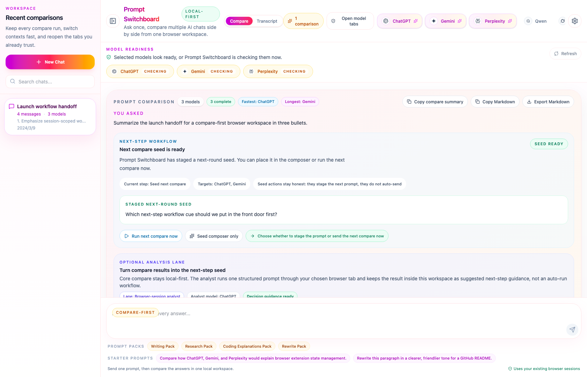
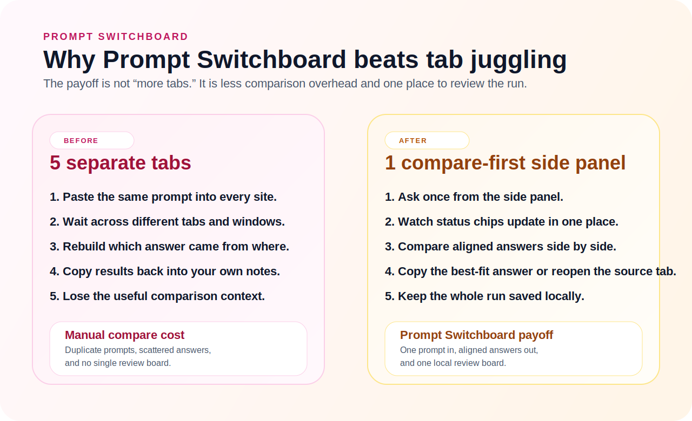
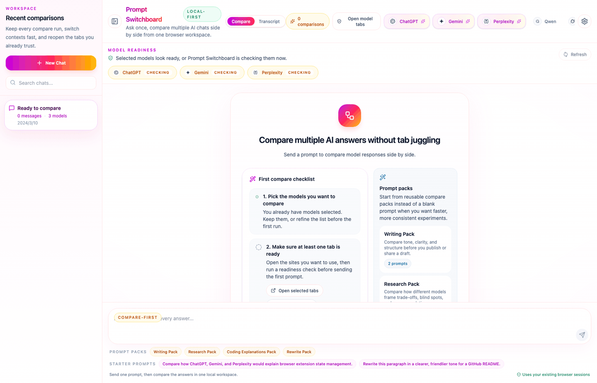
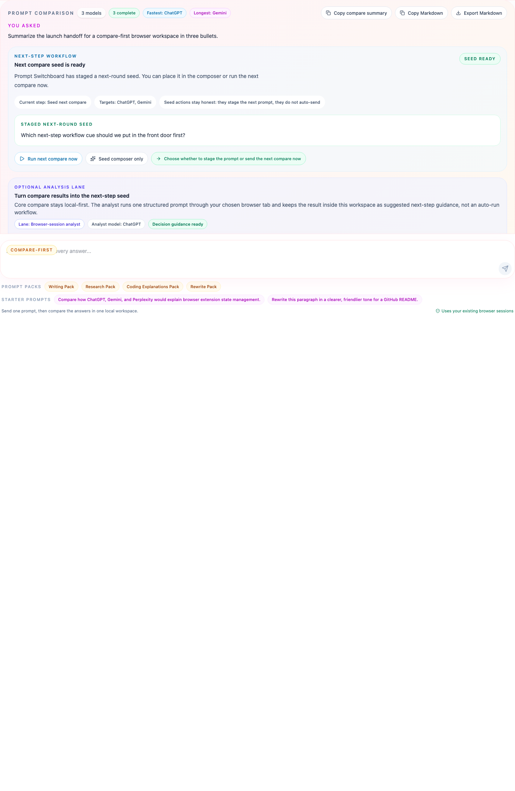
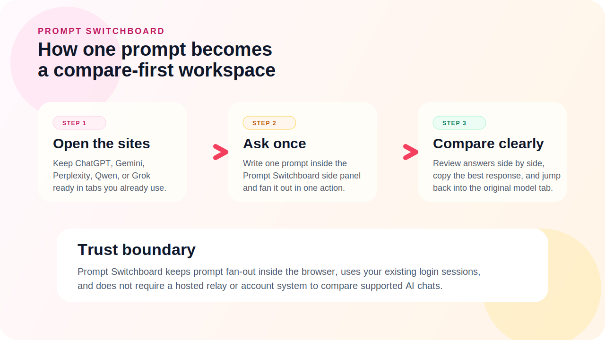
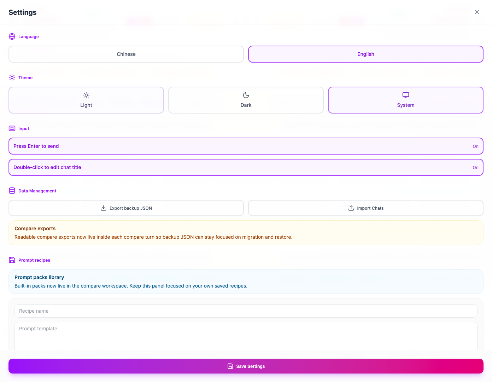

# Prompt Switchboard

One prompt, many AI chats, one side panel.

Prompt Switchboard is a **compare-first, local-first, browser-native AI compare workspace**. It lets you send one prompt to ChatGPT, Gemini, Perplexity, Qwen, and Grok, then compare the replies in one side panel instead of bouncing between tabs.

It also ships a governed local MCP sidecar for **Codex and Claude Code browser workflows**. OpenCode and OpenClaw stay on repo-owned public packet lanes until stronger host proof or official listing proof exists.

> **Trust boundary**
>
> Prompt Switchboard stays inside your browser, uses your existing sessions on supported sites, and does **not** add a hosted relay or account layer.
> The supported repo build also does **not** rely on OS-level desktop
> automation, Force Quit helpers, or host-wide process cleanup.

[Install the latest build](https://github.com/xiaojiou176-open/multi-ai-sidepanel/releases/latest) • [Landing page](./docs/index.html) • [Install guide](./docs/install.html) • [First compare guide](./docs/first-compare-guide.html) • [MCP agents](./docs/mcp-coding-agents.html) • [Docker sidecar](./docs/mcp-docker-sidecar.html) • [Distribution truth](./docs/public-distribution-matrix.html) • [FAQ guide](./docs/faq.html) • [Privacy](./PRIVACY.md) • [Security](./SECURITY.md) • [Building locally](./CONTRIBUTING.md)



The shortest way to evaluate Prompt Switchboard is simple: install the latest packaged build, keep the AI tabs you already use open, then ask once from the side panel and compare the answers in one place.

## What Is Real Today

| Surface         | Current truth                                                                                                                                                    |
| --------------- | ---------------------------------------------------------------------------------------------------------------------------------------------------------------- |
| Product install | **GitHub Release zip is the supported install path today.**                                                                                                      |
| Core product    | **Browser extension + compare-first side panel** with your existing signed-in tabs.                                                                              |
| Builder lane    | **Local MCP sidecar** for Codex and Claude Code, plus repo-owned starter packets for OpenCode and OpenClaw, and an optional Docker wrapper for the same sidecar. |
| Not live yet    | **Browser store, official registries, official marketplaces, and any Glama listing**.                                                                            |

The supported install path today is the packaged GitHub Release zip. Browser-store submission materials are being kept ready, but GitHub Releases remains the supported install surface today.

Before the first compare run, make sure the supported AI tabs you want to use
are already open and signed in inside the same browser profile.
The side panel now includes a first-run checklist and readiness repair actions,
so the shortest path to success lives inside the product instead of only in the docs.

## Default Path

If you only remember one route through this repo, remember this one:

1. **Install the latest build** from GitHub Releases.
2. **Run one real compare** from the side panel with the tabs you already trust.
3. **Stay in the same turn** to retry failures only or export a readable compare artifact.

Use these pages in that exact order:

- [Install guide](./docs/install.html)
- [First compare guide](./docs/first-compare-guide.html)
- [Prompt packs](./docs/prompt-packs.html)

## Why It Feels Worth Saving

- **Compare responses side by side**: keep the same prompt aligned across multiple model cards instead of bouncing between tabs.
- **Check readiness before you send**: see which selected model tabs are ready, still loading, missing, or likely affected by selector drift.
- **Repair blocked models without guesswork**: readiness now points you to the next action when a tab is missing, loading, mismatched, or not exposing the send controls.
- **Recover only the failures you care about**: retry the models that failed instead of replaying the whole compare run.
- **Turn disagreement into the next move**: seed the next compare round, keep seed-only actions honest, and run the next compare only when you choose to.
- **Carry useful results outside the side panel**: copy a compare summary, export Markdown, or keep a readable local artifact instead of only a backup dump.
- **Add optional AI analysis without replacing the core compare lane**: the AI Compare Analyst can summarize consensus, explain disagreement, recommend the best-fit answer to continue from, and draft the next question by reusing one browser tab you already trust, while the main compare flow stays local-first.
- **Expose product actions through a local MCP sidecar**: Prompt Switchboard can expose readiness, compare, retry, export, session, analyst, and next-step workflow actions to local agents without becoming generic browser automation.
- **Keep everything local in your browser**: no hosted relay sits between your prompt and the supported AI sites.
- **Reuse the AI tabs you already use**: Prompt Switchboard works with the browser sessions you already keep open.
- **Start from reusable prompt packs**: launch writing, research, coding, and rewriting compare runs without starting from a blank prompt every time.
- **Export, restore, and reuse compare runs**: carry compare runs between machines through local import/export and save repeatable prompt recipes.

## Try It Now

Before you start:

- a Chromium-compatible browser with Developer Mode available
- at least one supported AI chat tab already open and signed in

1. Open the [latest Releases page](https://github.com/xiaojiou176-open/multi-ai-sidepanel/releases/latest).
2. Download the packaged extension zip, unzip it locally, open `chrome://extensions`, enable **Developer Mode**, and use **Load unpacked** on the extracted folder.
3. If the Prompt Switchboard icon is hidden, open the browser Extensions menu, pin Prompt Switchboard, then click the toolbar icon to open the side panel.
4. Open the supported AI tabs you want to compare, then ask once from the side panel.

Today the public install path is the packaged GitHub Release zip. A lower-friction store distribution path is being prepared, but it is not live yet.

If you are validating the real Chrome proof lane, keep one extra rule in mind:
official Google Chrome branded builds 137+ / 139+ no longer reliably auto-load
unpacked extensions from command-line flags. Automated runtime proof should use
Chromium or Chrome for Testing. Real Chrome proof keeps the same signed-in
profile, then uses `chrome://extensions` -> **Developer Mode** -> **Load unpacked**
manually.

Need the local build path, release workflow, Docker sidecar lane, or front-door
maintenance steps? Read [`CONTRIBUTING.md`](./CONTRIBUTING.md) and the dedicated
[Docker sidecar page](./docs/mcp-docker-sidecar.html).

Maintainer-only cleanup and runtime hygiene commands stay in
[`CONTRIBUTING.md`](./CONTRIBUTING.md) so this README can stay focused on the
public product surface.

### Good First Compare Prompts

If you want to see the value quickly, try one of these on three or more supported sites:

- `Summarize the launch plan for a local-first browser extension in three bullets.`
- `Compare the trade-offs between React and Vue for a browser extension UI.`
- `Rewrite this paragraph in a clearer, friendlier tone for a GitHub README.`

### Explore By Use Case

- [Compare ChatGPT vs Gemini vs Perplexity](./docs/compare-chatgpt-vs-gemini-vs-perplexity.html)
- [Best AI for rewriting text](./docs/best-ai-for-rewriting-text.html)
- [Best AI for coding explanations](./docs/best-ai-for-coding-explanations.html)
- [Why local-first AI comparison matters](./docs/local-first-ai-comparison.html)
- [Prompt packs](./docs/prompt-packs.html)

### After The First Compare Works

- Retry only the failed cards from the same compare turn.
- Export a readable compare summary or Markdown artifact.
- Reuse [Prompt packs](./docs/prompt-packs.html) when you want a faster second run.

### Optional Builder Lane

If you already use MCP-capable coding agents, come here **after** the first compare works:

- [Prompt Switchboard for Codex, Claude Code, and MCP agents](./docs/mcp-coding-agents.html)
- [Prompt Switchboard MCP starter kits](./docs/mcp-starter-kits.html)
- [Prompt Switchboard MCP Docker sidecar](./docs/mcp-docker-sidecar.html)
- [Prompt Switchboard host packets](./docs/mcp-host-packets.html)
- [Prompt Switchboard public distribution matrix](./docs/public-distribution-matrix.html)

## Why It Beats Tab Juggling



The strongest product claim here is not abstract AI productivity. It is much simpler: Prompt Switchboard removes the messy part of side-by-side comparison.

| Manual multi-tab compare                        | Prompt Switchboard                                           |
| ----------------------------------------------- | ------------------------------------------------------------ |
| Paste the same prompt into every site           | Ask once from the side panel                                 |
| Wait in separate tabs and windows               | Watch status chips update in one board                       |
| Reconstruct which answer belongs to which model | Keep aligned model cards in one compare view                 |
| Copy results back into your own notes by hand   | Copy the best-fit answer or reopen the original tab directly |
| Lose the comparison context after the session   | Keep the run saved locally for export and restore            |

## How It Works

1. **Open the sites you already use**: keep ChatGPT, Gemini, Perplexity, Qwen, or Grok signed in inside normal browser tabs.
2. **Ask once from the side panel**: Prompt Switchboard fans the same prompt out from one local workspace.
3. **Compare clearly**: review the answers side by side, inspect the per-model run timeline, copy the best response, or jump back into the original model tab.
4. **Recover, export, and continue**: retry only the failed models, use the repair center when readiness blocks a run, export a readable compare artifact, or seed the next compare round from the completed answers.

## Builder Lane (After The First Compare)

Prompt Switchboard also includes a local MCP sidecar for product-level agent integrations.
That builder lane is real, but it is **not** the default first-stop story of the repo.
The default story is still: install, run one compare, then export or retry from the same turn.

- The sidecar speaks MCP over `stdio`.
- The extension bridge stays local on `127.0.0.1`.
- The exposed surface stays product-specific: readiness, compare, retry,
  export, session reads, the analyst lane, and workflow helpers.
- The optional Docker sidecar wraps the same local MCP surface; it does **not**
  turn Prompt Switchboard into a hosted compare service or public HTTP API.
- The MCP surface does **not** expose arbitrary DOM selectors or generic
  website automation.

Current truthful split:

- **Supported now**: Codex and Claude Code are the strongest repo-specific host
  flows.
- **Packet-ready, not published**: OpenCode and OpenClaw ship repo-owned public
  packets, but this repo still does not claim official published listings for
  them.
- **Still external-only**: package namespace control, browser-store
  submission, and any future marketplace or registry listing.

Use the repo-local operator helper for the main maintainer path:

```bash
npm run mcp:operator -- doctor
npm run mcp:operator -- server
npm run mcp:operator -- smoke
npm run mcp:operator -- live-probe
npm run mcp:operator -- live-diagnose
npm run mcp:operator -- live-support-bundle
```

Use these links instead of keeping the full builder ledger duplicated in the
README:

- [MCP agents guide](./docs/mcp-coding-agents.html)
- [Host packets](./docs/mcp-host-packets.html)
- [Public distribution matrix](./docs/public-distribution-matrix.html)
- [`mcp/integration-kits/support-matrix.json`](./mcp/integration-kits/support-matrix.json)
- [`mcp/integration-kits/public-distribution-matrix.json`](./mcp/integration-kits/public-distribution-matrix.json)

The machine-readable builder truth lives at
`prompt-switchboard://builder/support-matrix`.

Quick placement map:

- Codex -> `config.toml`
- Claude Code -> `.mcp.json`
- OpenCode -> project-root `opencode.jsonc`
- OpenClaw -> `openclaw mcp set` or `mcp.servers`

If host wiring looks correct but site behavior still feels brittle, read
`prompt-switchboard://sites/capabilities` next. That resource is the current
per-site DOM/readiness/private-API boundary map for the compare-first product
surface.

Native Messaging is **not** the shipped transport in this release. If you want
to explore that direction later, start from the scaffold notes in
[`mcp/native-messaging/README.md`](./mcp/native-messaging/README.md) instead of
treating it as an already-wired runtime path.



The demo now shows the actual product rhythm: ready state, compare fan-out, workflow staging, and a completed comparison board.

### Compare View



This detail view highlights the compare-first design with the current next-step lane: one prompt header, WorkflowPanel, analyst guidance, clear model identity, delivery status chips, and direct links back to the original site.

### Trust Boundary Map



The workflow map makes the runtime boundary explicit: Prompt Switchboard orchestrates the browser-side flow, while the supported AI websites remain the actual execution surfaces.

### Settings And Portability



Settings keep the project honest as a real tool, not just a hero screenshot: export and import, language, theme, and keyboard preferences all live inside the extension.

## Supported Sites

- ChatGPT
- Gemini
- Perplexity
- Qwen
- Grok / xAI

These integrations depend on live DOM structure. When a supported site changes markup, Prompt Switchboard may need selector updates before the compare flow fully recovers.

Need the public-facing install and support detail page? Read [`docs/supported-sites.html`](./docs/supported-sites.html).

## Good Fit / Not The Goal

**Good fit**

- You already use multiple AI chat sites and want a faster way to compare answers.
- You want the trust boundary to stay inside the browser instead of adding another hosted layer.
- You want session history and settings to stay local-first.

**Not the goal**

- A cloud dashboard that proxies prompts through a backend.
- A provider-neutral SDK for arbitrary model APIs.
- A browser automation framework for non-supported websites.
- A generic AI chat app that replaces the compare-first browser workflow.

## FAQ

Use the public support pages for the shortest answers:

- [`docs/install.html`](./docs/install.html)
- [`docs/supported-sites.html`](./docs/supported-sites.html)
- [`docs/trust-boundary.html`](./docs/trust-boundary.html)
- [`docs/faq.html`](./docs/faq.html)

The short version is still:

- no hosted relay
- no browser-store install today
- no public SDK or generic browser automation claim

## Support

Use the public issue tracker for non-sensitive bugs, setup questions, or product feedback:

<https://github.com/xiaojiou176-open/multi-ai-sidepanel/issues>

For security-sensitive reports, follow [`SECURITY.md`](./SECURITY.md) instead of opening a detailed public issue.

For open-ended product ideas, workflow discussion, or compare-first feedback, use GitHub Discussions:

<https://github.com/xiaojiou176-open/multi-ai-sidepanel/discussions>

Track packaged builds and release notes on the [Releases page](https://github.com/xiaojiou176-open/multi-ai-sidepanel/releases).

## Why Star It Now

If Prompt Switchboard makes multi-model comparison easier for you, star the repo so the latest packaged builds, selector drift fixes, and compare-first front-door updates stay easy to find.
